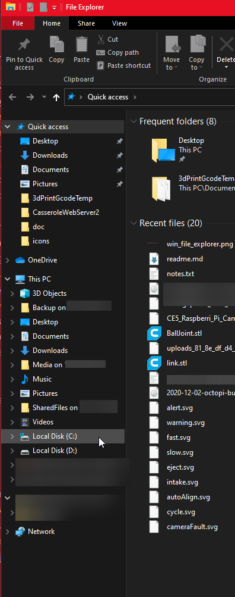

## Lesson 1.1: Acquiring Software

More than likely, you're reading this online, in a web browser now. You can click around to see other files, make small modifications. This is a very nice feature of *Github*, the website on the internet where we we keep our software.

However, to run the code, and make bigger changes, you'll want the software on your computer.

*Git* is the name of the tool we use to move software between *Github*'s servers and our development computers.

As a one-time, first step, we will use the `clone` operation to do a first-time acquisition of software from github. Later, we will use other commands to `push` and `pull` changes from our local `repository` of software.

 But why do all this? 

In a team-based software development environment, you rarely start writing all your code from scratch (in fact, exactly one student does this once per build season). 

More frequently, you are starting your development _based on_ the work someone else already did. You take their content, modify it, add your own things, and submit it back for the next person to work on. Multiply this by 10+ people, and you've got a team developing a singular codebase! 

The reason we need tools like Git and Github are to ensure that all people can contribute their changes without "stepping" on each other, using different computers. 

It additionaly ensures that, as a team, we have a singluar notion of what the "correct" or "most recent" software is. 

All of this is key to ensuring the software we make is high-quality, and defect-free.

Perform the following steps:

1. Open the *Windows file explorer* 

2. Create the folder `C:\Users\<username>\SwDev\`, if it does not yet exist. Open that folder in the file browser. 

 If you're new to this sort of thing... 

Here's one set of steps to accomplish that:

Select the `C:\` drive:

Select the `Users` folder, followed by your username:

Right Click in the empty space, hover over `New`, and make a new folder:

Type in the approprate name for the new folder:

3. Right click in the empty space in the folder to get the context menu, and select `GitExt Clone`.

4. Paste the following *URL* into the top "Repository to clone" box: `https://github.com/RobotCasserole1736/OffseasonTraining`

5. All other default options are fine. Click the `Clone` button.

You may be prompted for your github username and password - enter it if needed.

Afterward, you should see a new folder named `OffseasonTraining`.

Huzzah! You now have some software on your computer, which you can begin to edit.

Feel free to go poking around inside the new `OffseasonTraining` folder. You should see many `.java` files containing our source code, some `.md` files for documentation, and a host of other supporting files.

