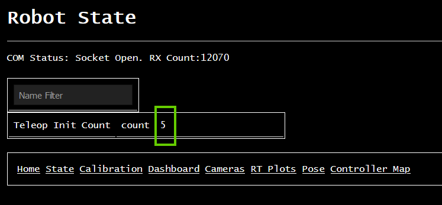
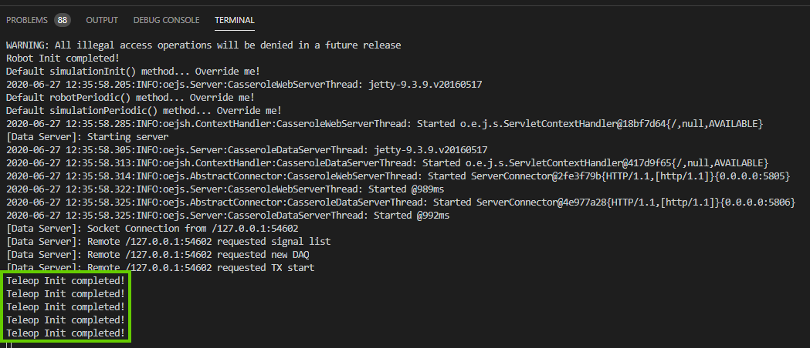

# Lesson 1.3: Interacting with Robot Code

If it's not yet running, start your code running as you did in the previous lessons, using `F5`.

## Robot Website

Open the Chrome Web Browser and go to `http://localhost:5805`. 

You will be presented a website like this:

Click the `State` link, and you should see another webpage. 

## Locating the Source of Data

Note that while many variables aren't changing, a few are. 

There is a variable in `Robot.java` for counting the number of times we've called `telopInit()`, marked to be a `@Signal`.

Find it in `Robot.java`, and note its name.

## Changing Robot State

Adjust your screen so that you can see the `State` page on the robot website, and the Robot Simulation GUI at the same time.

In the Simulation GUI, Click the Robot State to `Teleoperated`, then back to `Disabled`. Repeat this a few times.

Notice that every time you click to `Teleoperated`, the `Teleop Init Count` should increase by one. 

You may also notice, when you click `Teleoperated`, in the *Terminal* in VSCode, a new thing is printed every time:

See if you can locate the lines of code which cause these changes.

Let's look at this hunk of the code, which happens to run once every time we start operation in `Teleoperated` mode:

The first line contains the code `teleopInitCounter++;`.

Every time this code runs, that `++` operator makes the value inside of the variable `teleopInitCounter` _increment_, or increase by one. 

The second line is like what we saw before: `System.out.println()` code injects custom messages into the Terminal.

Stop the code by clicking the stop button at the top of VS Code:

