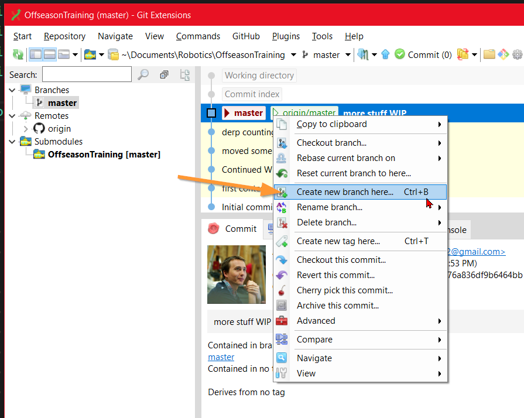
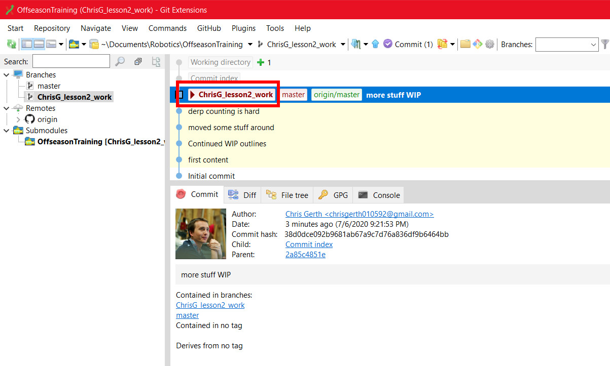

# Lesson 2.1: Variables and Math

## First Concepts

### Variables & Types

A _variable_ is a named "storage container" that holds some piece of information. Often, this information is a numeric quantity.

Though not identical to the variables you know from Algebra, you can often think of them the same way.

Variables have a _type_, which defines the sorts of values they might hold.

Simple types include `boolean`, `int` and `double`. 

A `boolean` stores a value which can only be _True_ or _False_. It's good for things like switches or logical conditions - things which can _only_ ever be "this" or "that".

An `int` or "integer" type stores whole-number values. It's good for when you want to count "how many".

A `double` or "double-precision floating point" type stores a real number, like `-2.5` or `3.14159`. It's good for expressing measurements, like the speed of a wheel (in RPM). 

Always choose the "simplest" type to describe your variable. Not only will this make the code run faster, but it will help communicate the _meaning_ behind your variable. 

### Declaring Variables

Variables need to be _declared_ before they can be used. This _declaration_ process is used by the computer to know to set some _memory_ aside for us to save numeric values for future use or manipulation.

Variables get declared using the following _syntax_:

`<type> <name> = <initial value>;`

`<initial value>` is technically optional, but is highly recommended, especially for any robot code.

For example:

`double shooterSpeed_RPM = 20;`

This line of code creates a new variable of type `boolean`, named `shooterSpeed_RPM`, and sets it equal to `20` to start. Its value may change in the future as we write new values to it.

### The Meaning of `=`

In software, a single equals sign (`=`) is referred to as the "assignment" operator. It tells the computer to take the thing on the _right side_, and put it into the thing on the _left side_.

The value on the left side is almost always a single variable name. The value on the right side is usually a more complex expression of numbers and variables and other things.

Unlike in "normal" math, reversing the order is _not allowed_. The _assignment_ operation has a source and a destination, and these two concepts aren't interchangable. The source must always be on the right, and the destination must always be on the left.

### Math 

Variables are combined and manipulated using basic math operations you are probably already familiar with.

`+`, `-`, `*`, and `\` represent addition, subtraction, multiplication, and division.

The `=` equals sign means "calculate the value on the right side, and store it into the variable on the left". Though this often looks like the usual math expressions (`4 = 3 + 1;`), keep in mind direction is important. Calculate right, assign left. That's why it's called the _assignment operator_.

Programming languages have an "order of operations", just in normal math. Just like normal math, you can use `(` and `)` parenthesis to group operations together, changing the order of operations.


<details>
<summary> Note</summary>
Chris learned the acronym PEMDAS (pronounced "paehm-dahs") to describe the Math order of operations. (Parenthesis, then exponentiation, then multiplication, then division, then addition, then subtraction). Chris also learned the trigonometric ratios and functions with the pneumonic not as our Native American friend SOH-CAH-TOA, but as "Some Old Hippie Caught Another Hippie Tripping On Acid" This explains a lot about Chris. We'll assume none of these are commonly-used pneumonics, and avoid their usage. But if you happen to know them, well, you can assume you'll turn out like Chris.
</details>


For example:

```java
result = 10 *  20 + 30;  
// result is now 230: First, 10*20 is 200. Then, 200+30 is 230.
result = 10 * (20 + 30); 
// result is now 500: First, 20+30 is 50. Then, 50*10 is 500.
```

## Problem 0 - Starting off.

Open a windows file explorer in the folder for the training repo we _cloned_ last practice. Right click in the white-space, and select "Git Extensions Browse".


In the git extensions window that pops up, right click on the latest node you have checked out, and select "Create new branch here".



Create a unique name for your branch. `yourname_training` is a good way to start, but feel free to get creative!

Default options are fine. Select all the "happy" buttons, hitting "Create" and "OK" until you see your new branch:



## Problem 1 - Basic math operations.

Create three new variables, named `val1`, `val2`, and `val3`. All should be the type "floating point". Pick any initial values you want, but make sure at least one is negative, and one has some fractional part (ie, `10.5`).

Calculate the sum of `val1`, `val2`, and `val3`, and store the result into `result1`. 

What do you expect the result to be?

Run your code, visit the website, and confirm the result matches your expectations.

## Problem 2 - More math operations.

Create a new line of code which uses `val1`, `val2`, and `val3`, and does some math on them. It should also use parenthesis, division, and subtraction. Store the result into `result2`. Constant values (like `23.67`) are allowed.

Ensure that, with your choice of line of operations, `result2` ends up having a value between 40.0 and 50.0.

Calculate the value you expect your line to be. Run your code, visit the website, and confirm the result matches your expectations.
