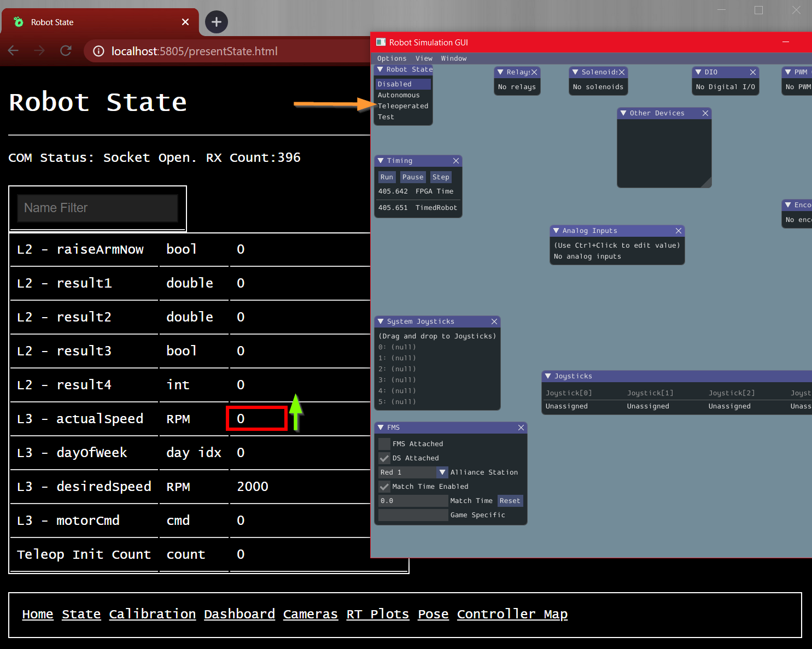

# Lesson 3.3 - "Bang Bang" Shooter Wheel Control

We're going to introduce a few new concepts here to tie `if/else` statements back to robot design. If you're new, this will probably be a bit of a "firehose" of facts tossed at you. Fear not, understanding the fine details of "why" these facts are isn't important for this problem. We're just going to introduce the facts and let you use them to solve a problem. Later in the season, we'll wrap back around to the "why". But for now, just memorize them.

## Theoretical Background

Generally, when shooting a ball into a goal or target, we will launch it using a rubber wheel. Very much like one of those baseball or softball pitching machines.


To shoot the ball consistently and accurately, one key is to ensure the shooter wheel is **running at a constant _speed_**. 

There are sensors which can measure the wheel's _actual_ speed (usually in units "revolutions per minute", or RPM). From prototyping, we'll know some _desired_ speed - also in RPM. Usually this will be around 2000.

The shooter wheel is powered by an electric motor. Motors receive electrical power over wires, and convert it into spinny motion.

In software, we can't directly control the speed of the motor - we only can control the amount of power it receives. We send this in the form of a "command".

By convention, motor commands are floating point values between -1.0 and 1.0. 

* -1.0 means "full reverse!". 
* 0.0 means "Stop!". 
* 1.0 means "Full forward!".

For shooter wheel control, the software has to compare the _actual_ and _desired_ speeds, and determine some power level to send to the motor. You have to cleverly design your software to ensure that, over time, the _actual_ speed gets closer to the _desired_ speed.

A very simple strategy for doing this involves a simple if/else statement. The logic has to be:
1) If the shooter wheel is too slow, apply full forward motor power.
2) If the shooter wheel is too fast, apply no motor power.

## Problem 

Your task will be to write the software to control a simple simulated shooter wheel.

Right now, `motorCmd` is set to an unchanging value of `1.0`, which always runs the shooter wheel at full power. 

```java
        motorCmd = 1.0; //Incorrect - Motor always runs. You'll need to change this.
```

Run the code without modification to verify this. Open the website, go to the Robot State page, and then enable the robot in Teleoperated.

When enabled, `desiredSpeed_RPM` will exceed `actualSpeed_RPM` by a lot. 

As the comment notes, this is incorrect - the ball will launch too far. We will need to remove this line of code, and replace it with the correct logic.

Use the above information to write new code to compare `actualSpeed_RPM` and `desiredSpeed_RPM`, and assign some value to `motorCmd`. Use your new code to replace the incorrect line of logic.

Don't worry about how values get put into `actualSpeed_RPM`, or where they go after you write to `motorCmd`. Someone else has already taken care of that, and we'll discuss more about it later in the season. For now, just do some comparison on your actual/desired speeds, and (using the results of that comparison) write the results into `motorCmd`.

Be sure to do this inside the indicated code block:

```java
    void lessonThreeEnabledUpdate(){
        ////////////////////////////////////////////////
        // Write your new code for Lesson 3.3 after this line...


        // ...but before this line.
        ////////////////////////////////////////////////
```

Run the code, and bring up the simulation GUI _and_ the website. Note the robot is disabled:


If you added your code in the correct spot, it should start the shooter spinning when you enable the robot:



What "actual" RPM value do you expect the motor speed to go to once you enable the robot? Does it go there?

Change the initial value of `desiredSpeed_RPM` and see how the "actual" RPM value changes.

<details>
<summary> Note </summary>

The name "bang-bang" comes from how the software manipulates the `motorCmd` variable. It slams it to full on, then full off, then back on again, then off.... It's actually not the best for robots and motors, as we'll learn later in the year. 

However, for things like rockets, it's the only real strategy you have for control, because rockets can (usually) only be on or off.

</details>
