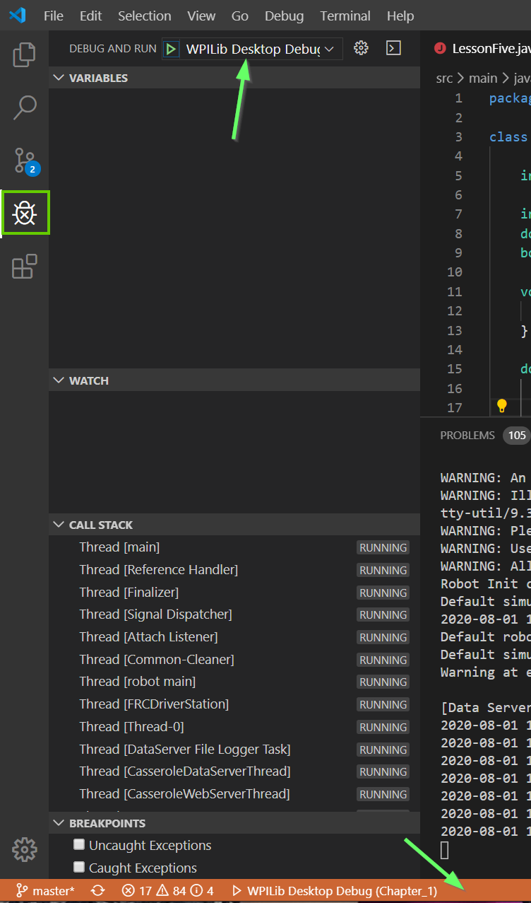
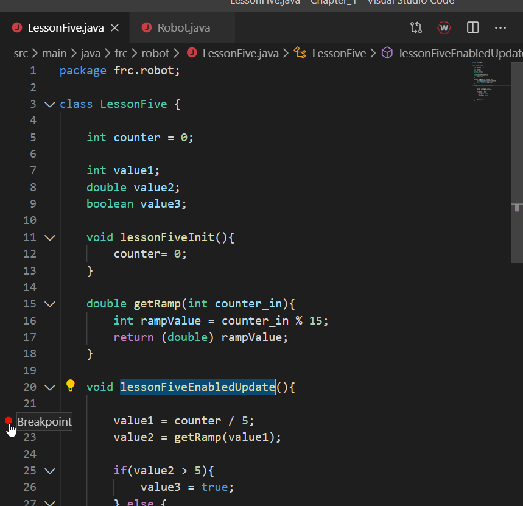
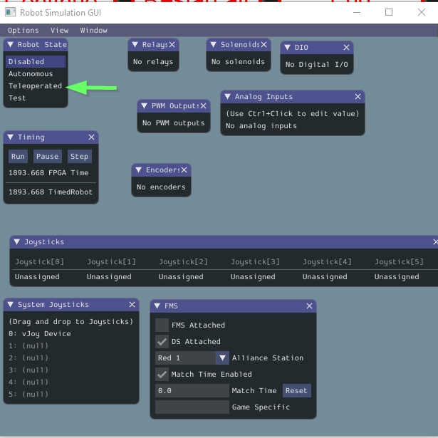
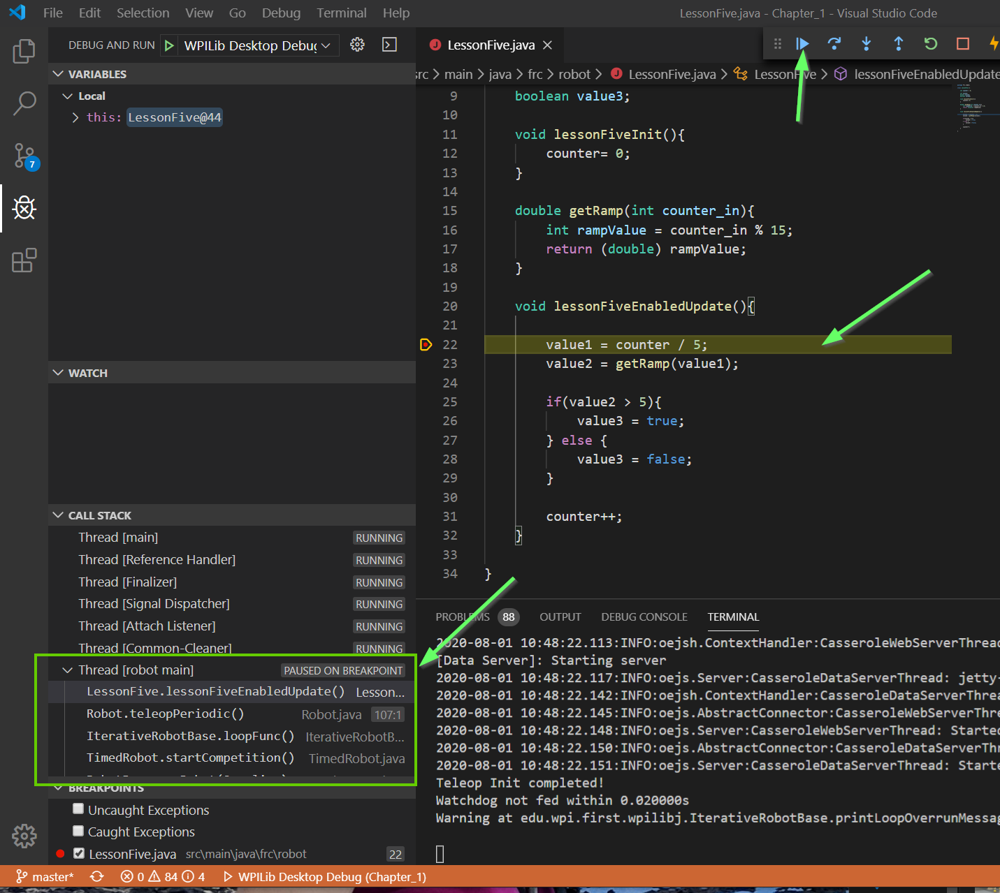
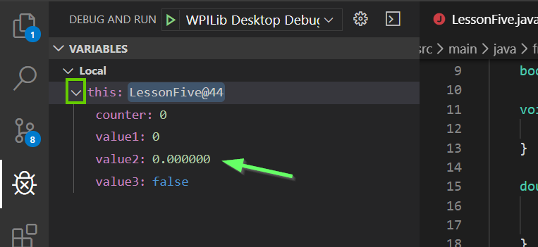
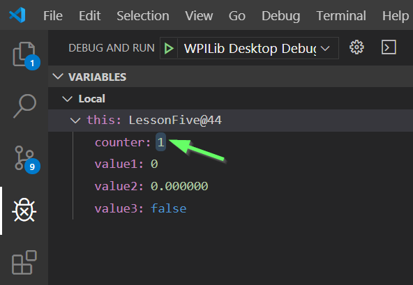
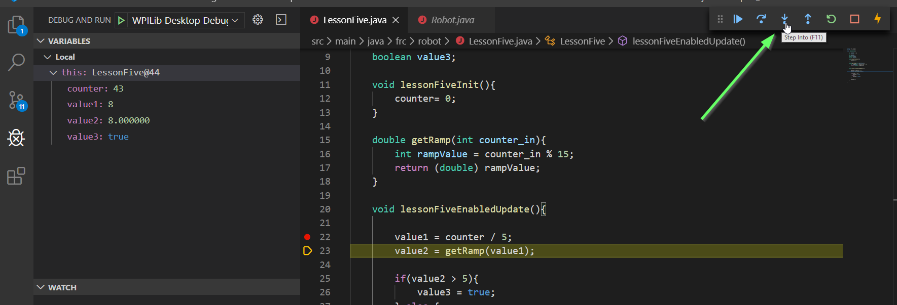

# Lesson 5.1 - Using the Debugger

Up till now, the pieces of code we've written are pretty small. Small enough that _by just staring at the code_, you can probably predict how it will work.

Ideally, as we write more and more code, we'll keep it as organized as possible, to help keep this "inspectability". However, inevitably, bigger projects create more complex problems, that need more advanced tools to unravel.

We've already looked at one of these tools: inserting `System.out.println()` calls at critical portions of your code allow you to check multiple things. This includes order of execution, and values of variables at various times.

You've also seen the website utilities, which allow you to see values of variables as they change over time.

We will introduce one additional tool that you can use to help investigate problems. It's called the _single step debugger_, or simply the "debugger".

The debugger allows you to stop code execution on certain lines, "step" through your code's execution line by line, and print out values of variables and expressions at runtime. The biggest advantage of the debugger is that it doesn't require injecting any additional lines of code into your software - it _just works_. (usually :D).

When running code locally on a desktop, the debugger is automatically running in the background - nothing special you have to do to start it.

Regardless of what debug tool you happen to be using, the technique for solving problems is generally the same:

1) Look at the code, and decide how you are expecting it to work.
2) Investigate the code as it executes from start to end.
3) Find the first place where the behavior of the code deviates from your expectations.

The important thing to keep in mind: When you see errors, or software that doesn't work like you'd expect, don't get discouraged! There is a solution, it will just take time and technique to find it. Practicing this technique, over and over again, is how you get better and better at creating software!

## Walk-Through

We'll now walk you through basic usage of the debugger that's available for robot code. 

The same debugger can be used to inspect code behavior on both the robot and on your desktop. We'll start by debugging code running on our desktops.

Start by opening `LessonFive.java` in vsCode.

### Launching the Debugger

The debugger is automatically enabled when running software on your PC. Just press `F5` on your keyboard like normal, select the HAL sim GUI .dll, and let it run. You should see the sim GUI pop up. The debugger is now running in the background, ready to be used to analyze code behavior!

You've probably seen the controls before, but here's the more detailed explanation of what each button does:

Additionally, click the "bug-with-an-X" on the left side of vsCode to open the debug pane:

The orange bar at the bottom of the window indicates debugging is active right now (blue indicates nothing is running). Additionally, you can see that we launched the `Desktop Debug` routine, as expected.

Take a quick look at the code in the  `LessonFive` class. You can see it has a method named `lessonFiveEnabledUpdate()`, which is getting called inside `Robot.java`'s `teleopPeriodic()` method. Therefor, to "active" or "run" the lesson five code, we know we'll need to have the robot in the Teleop enabled mode.

### Setting Breakpoints

Remember that a computer executes a program line by line, starting at the top, going through method calls as needed, calculating and assigning values for each line, then moving on to the next line.

A "breakpoint" is a flag sent to the program to tell it to stop execution once code reaches the start of a certain line. "Setting" a breakpoint is the act of setting that flag on a particular line of code.

To set a breakpoint in vsCode, simply click in the space to the left of the line numbers in a particular file. 

Let's go ahead and do this on the first line of `lessonFiveEnabledUpdate()`.

There should be a bright red circle that appears next to the line. Nothing else will happen at this point, because we're _not yet calling this method_.

Quick knowledge check: _Why isn't this function getting called?_ Check your answer below.

 Explanation 

The robot defaults to being in the Disabled state. In `Robot.java`, you can see that in `disabledPeriodic()`, there is indeed no call to `lessonFiveEnabledUpdate()`. Because of this, during the Disabled state, `lessonFiveEnabledUpdate()` should _NOT_ be getting called. The fact that the debugger does not hit this line of code while disabled proves this functionality. Huzzah!

With our breakpoint set, let's go ahead and enable the robot code. Do this by selecting `Teleooperated` from the `Robot State` pane in the Robot Simulation GUI:

As soon as you do this, `lessonFiveEnabledUpdate()` will get called, and we should _hit the breakpoint_. Here's what that looks like:

The most obvious indicator is the yellow highlights on the breakpoint and line. It indicates the program is currently stopped on this line of code.

You'll additionally see our previous "Pause" icon in the debugger controls has changed to a play button. Since the code is now stopped, we have a few options for what we can do, including continuing execution until the next breakpoint.

Finally, you'll see the *Call Stack* in the bottom left. This shows not just where we're currently at in the code, but some info about _how we got here_. Specifically, you can see that `LessonFive.lelssonFiveEnabledUpdate()` (where we're at) got called from `Robot.teleopPeriodic()`, as expected. Below that, `Robot.teleopPeriodic()` got called from other code that's internal to WPIlib, and can be ignored.

### Viewing Variable Values

One of the main things you'll want to do while the code is stopped is to view the values that are presently stored in each variable. You can click the `>` character next to the `this` portion under the Variables window to expand out a list of all variables in the LessonFive class, and their values:

All are currently zero. This is because we haven't really run any code yet: Remember, we stopped on the first line of the first call to `lessonFiveEnabledUpdate()`. They're still all at their init values. Which, in this case, happens to be zero.

Go ahead and click the Continue (or "Play") button in the debugger controls. This will let the code continue to the next breakpoint. 

Since we only have one breakpoint in our `periodic` function, execution should continue through the rest of this loop, and stop at the beginning of the next.

You should see execution stop on that same line with the breakpoint again, but the variables have now changed values:

Congratulations! You've done the most basic form of debugging, which is extremely powerful! Merely the ability to stop code at a certain point and inspect variable values gives you vast opportunities to understand code behavior, and determine what sorts of things have gone right or wrong.

### Stepping through lines of code

Let's take the next _step_ (ha). We don't just have to set breakpoints every time we want to stop execution. Once stopped, we could instead step through lines of code, one by one, and inspect how variables have changed each time.

Presumably, your debugger is still up and running from before, at the start of `lessonFiveEnabledUpdate()`, with `counter` equal to `1`.

Go ahead and start clicking the "Step Over" button, one at a time, and watch how the yellow cursor moves through code.

Once you hit the end of the `lessonFiveEnabledUpdate()`, go ahead and hit the Continue (or play) button and let execution wrap back around to the start of the next loop.

Notice that counter is ticking up by one, every time you cross the `counter++;` statement (as you should expect).

However, value1, an integer, is getting set to zero usually (remember, integer division rounds down). This in turn yeilds the behavior you're seeing later on.

Keep hitting step-over or continue until counter equals six. Ah ha! Finally, some other values.

Step again over each line of code, and note how some different values are calculated.

#### Over vs. Into

One of the times while stepping through code, when you hit the line that has the call to `getRamp()`, try clicking the "Step Into" button.

Ah, nifty! This time, rather than _stepping over_ the call to `getRamp()`, we trace execution _into_ the method!

You can see in the bottom left how the call stack has one new thing on the top - `LessonFive.getRamp(int)` was called from `LessonFive.lessonFiveEnabledUpdate()`, again as expected.

You can see we also have a new variable visible, `counter_in`. This was our input argument. Step through the two lines of code, and past the end of this method. Notice how it returns to the previous call point.

Finally, when we're done, go ahead and click the red square in the Debugger Controls to stop the debug session.
