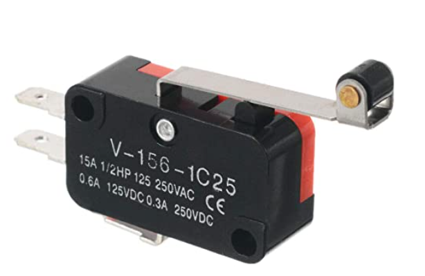
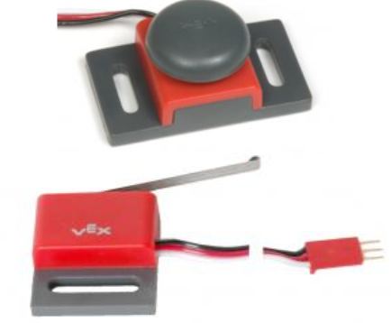
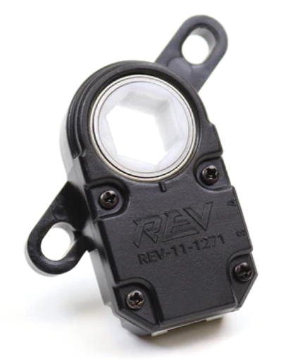
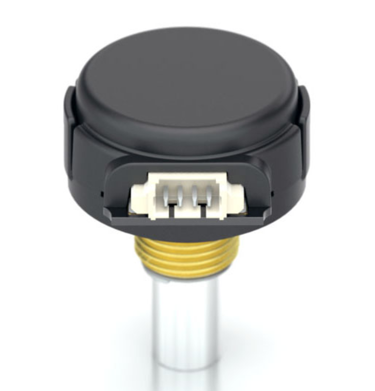
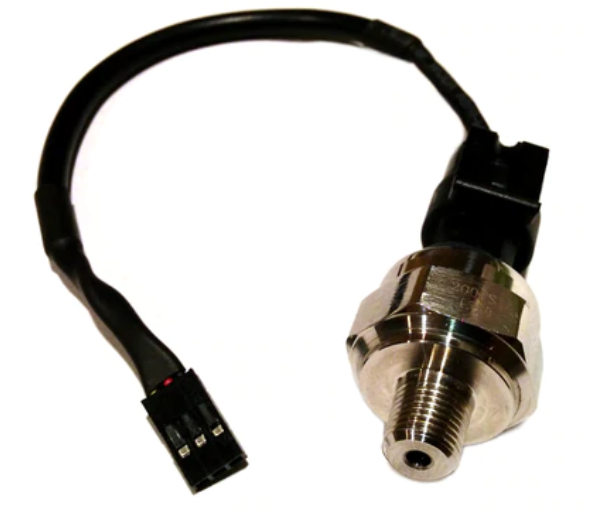
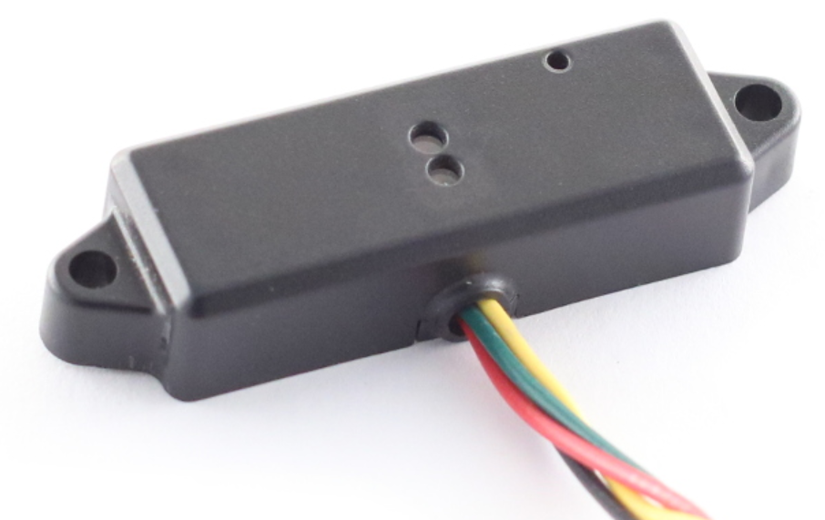
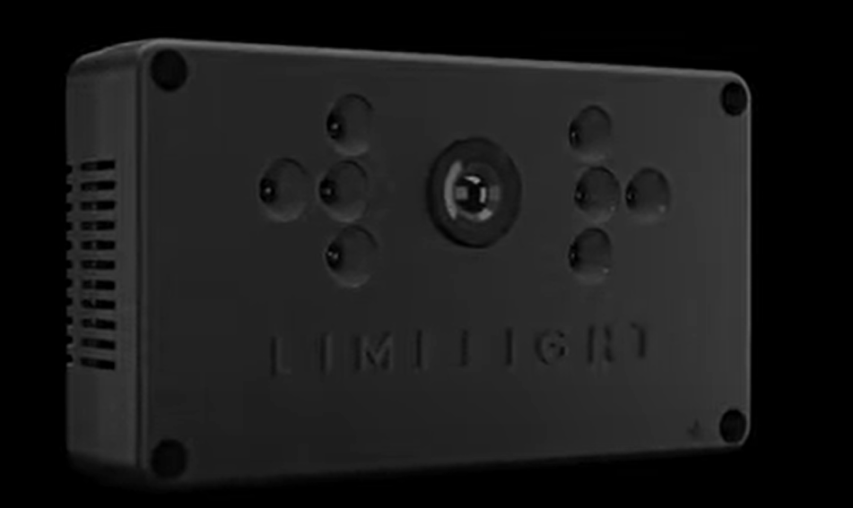
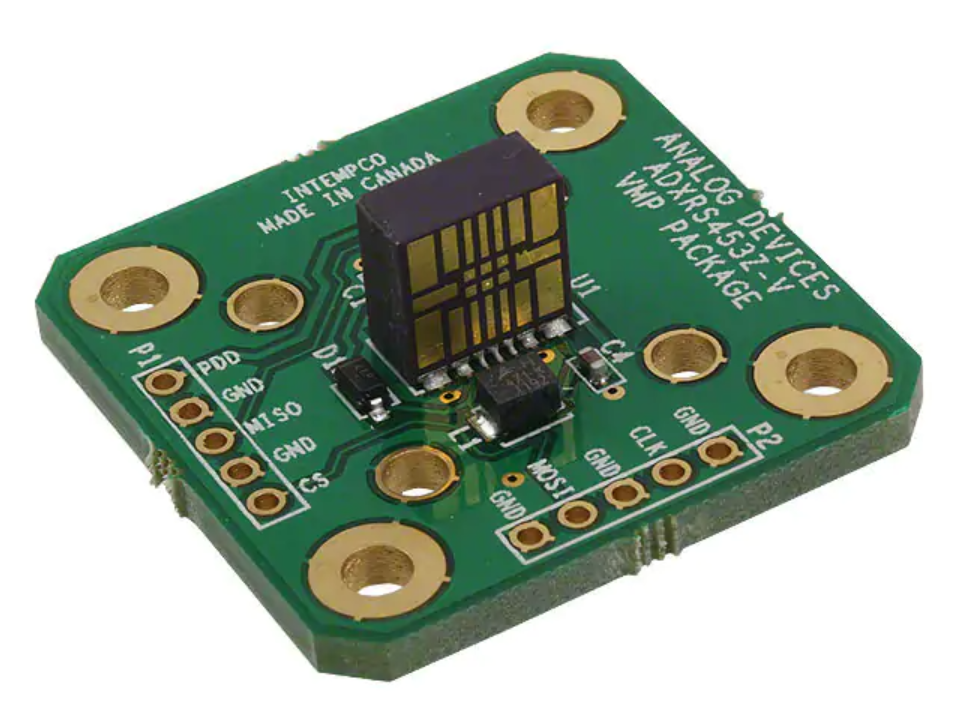
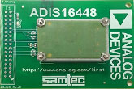

## Lesson 2 - Sensor Inputs

### Background

We'll now move on to creating a portion of the logic to control the elevator. For this robot, the elevator is the most complex system, because it has multiple _sensors_ which help constrain its motion. We'll start by studying and writing code for those sensors.

_Sensors_ are devices which measure physical quantities, and report them back to the software. We can use sensors to display information, or control behavior. 

### Limit Switch

These are some of the simplest of sensors. THey go by many names, including "touch sensor" or simply "switch". Their job is to detect when a part of a mechansim is at a certain position.





They create "boolean" data - either the switch is pressed, or it is not. In software, this will yeild True in one state, False in the other. True often means "pressed", though not always - it's something to confirm with electrical team. 

When doing the mechanical design of the robot, it's important to place these caefully so they detect motion exactly when needed, don't get damaged, and don't slip or move during competition.

We have three on the robot. See the readme for more info.

### Encoder

An _encoder_ is a device which measures rotation. It can measure distance rotated, or rotational speed. Using a bit of math, we can also calculate a linear distance traveled, or a linear velocity.





Encoders work by generating a "train" of 1 0 1 0 1 0 pulses as they rotate. The roboRIO counts the total number of pulses recieved to calculate distance. The quantity of pulses recieved in a fixed period of time represents speed.

The robot has one on the elevator. See the readme for more info.

### Other 

There are a handful of other sensors which, though not on our robot, are worth mentioning for awareness. Keep them in mind as we start to design our robot for this year - they are tools in your toolbox which can be used to help sense the world around you, and automate the robot's actions

#### Pressure Sensor

A pressure sensor produces an analog voltage between 0-5V in response to air pressure at its measurement input. We can do some math on the roboRIO (specific to the sensor) to convert the measured voltage back to whatever pressure we have in our air tank.



This is useful to help notify the driver about how much air they have left in the tank, and deduce performance of the pneumatic system overall.

#### Distance Sensors

When you want to measure linear distance to some point, encoders aren't the only option. If the target surface has a nice flat face, you can use some form of a distance sensor to measure the distance. 

The good distance sensors we use are all light or laser based. They emit a pulse of light, and use some circuitry to measure the duration of time it takes for the light to bounce back to the sensor.




There are similar sensors which use ultrasonic sound to perform the same activity, but usually don't fit the requirements of FRC. We generally don't use them.

#### Vision processing

It's a bit of a complex system, but we can treat a vision processing system as a single sensor.

A vision processor includes a camera, some LED lights to illuminate the target, and an additional processor which analyzes the image to determine if there is a target seen (and, if so, where it's at).

Some off-the-shelf vision processors include Limelight cameras.



However, historically, we've made our own out of a raspberry pi. It's pretty straightforward.

#### Gyroscope

A _gyroscope_ is a sensor we use commonly. It's part of a broader class of sensors used for "Inertial Measurement" - measuring the motion of the robot in 3D space. The gyroscope provides the main piece of information we care about for robotics - which direction is the robot pointed in? Down the field, or toward our drivers? Or somewhere in between? This information is critical for acacurate and repeatable autonomous routines.







### What to Implement

We'll be starting the work of implementing our elevator routine - just the breadcrumbs to read sensors and get input from the user. We'll save our actual logic for next time.

Create a new `.java` file to hold our new class, `ElevatorControl`.

Add the following methods:

```java
    public ElevatorControl(){
        // Initialize all required variables & objects here
    }

    public void setRaiseLowerManualCmd(double cmd){
        // Recieve a manual up/down command from the 
    }

    public void update(){
        // 20ms main periodic update
        // read all sensors, 
        // calculate an elevator motor command
        // Send that command to the motor
    }

```

Add code to the class and it's methods to implement the following:

#### Encoder

Add a [WPILib Encoder](https://first.wpi.edu/FRC/roborio/release/docs/java/edu/wpi/first/wpilibj/Encoder.html) to the class. Init it in the constructor, read its value into a class-scope variable in the class in the update function. Use class-scope globals to hold the height of the elevator as necessary.

Read the "engineering-units" value of the encoder into a class-scope variable. It should report the elevator height in feet. Mark this variable as a signal with the proper units.

#### Switches

Add Three new [WPILib Digital Inputs](https://first.wpi.edu/FRC/roborio/release/docs/java/edu/wpi/first/wpilibj/DigitalInput.html) to the class. These will read the value of the two top and one bottom limit switches. Init them all in the constructor. Read their values in the periodic update function. Use class-scope globals to hold the state of the limit switches as necessary.

Add three new signals to hold the value of each of these digital inputs. Read their values into class-scope booleans (with `true` representing "Pressed" and `false` representing "unpressed"). Mark each boolean as a signal.

### How to Test

Run your code, ensure nothing crashes, and all new signals show up on the website, with meaningful values.

We will need to be able to move the elevator up and down to test the full functionality. For now, we will delay this testing till a future lesson. However, keep in mind we may have to wrap back around to this lesson and its contents.
