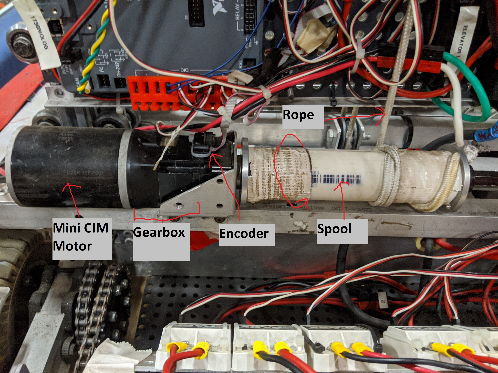
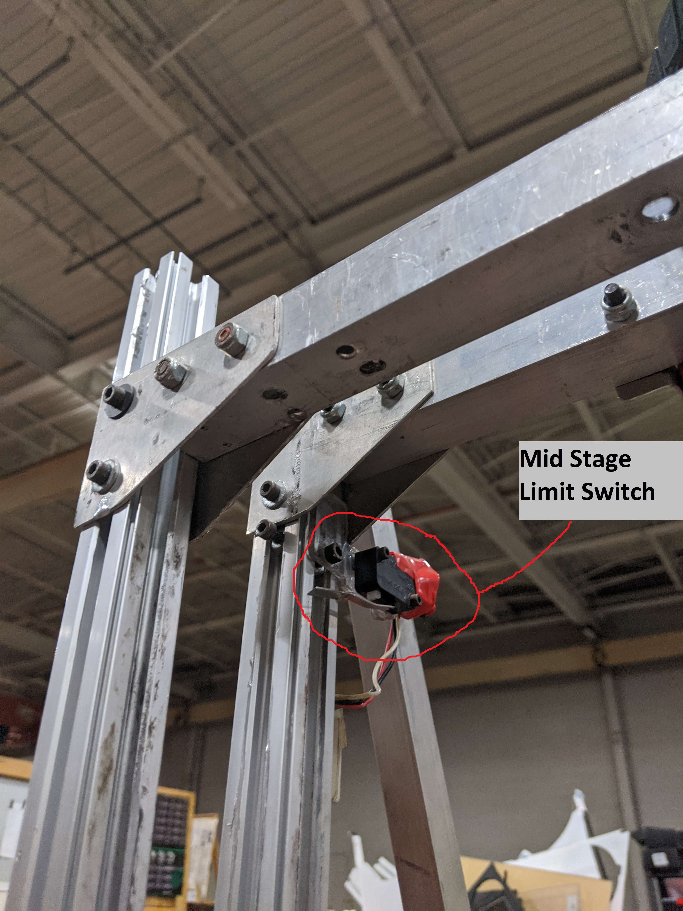
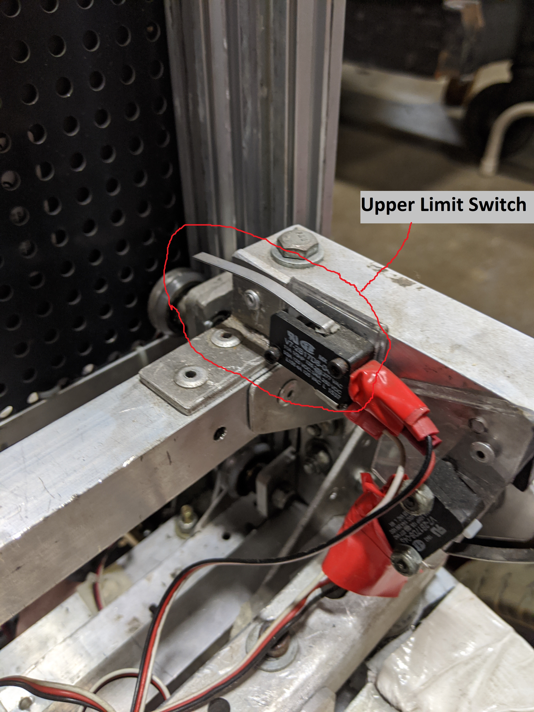
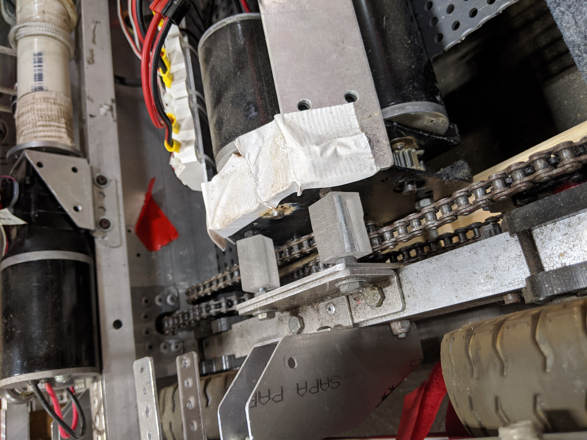

# Chapter 2 - The First Robot

In Chapter 1, we introduced some of the basics of software writing and the toolset we're using.

We'll move on to applying those concepts to making software for an actual robot that is at the warehouse!

## Background - the "Theoretical" Robot We will be Programming

This background info is pertenant to all lessons in this Chapter, so we put it here. It's not necessary to have a _complete_ understanding of every word in this section at the moment, but be ready to come back and reference it as needed. Ask questions now, the instructors can help guide you on what knowledge you need to get started.

The robot we will be programming is designed to play (most of) the 2018 game. If you haven't seen it, at least check out [the sumamry release video here](https://www.youtube.com/watch?v=HZbdwYiCY74), and maybe the [full game manual](https://firstfrc.blob.core.windows.net/frc2018/Manual/2018FRCGameSeasonManual.pdf) if interested.

Our robot will be able to do everythin in the 2018 game _except climb_. Looks very similar to our 2018 bot, because it is. 

It's had the climber removed for safety and simplicity, and the electronics swapped out with cheaper alternatives. Therefor, though you can _reference_ the 2018 code for information on how to operate the robot, copying-and-pasting code directly is likely to _not work_. 

And, that's intentional :). The goal of this lesson is to help you learn to write code for a paritcular robot, but without completely "throwing you to the wolves" on something completely unknown.

#### Drivetrain

The drivetrain follows a classic "Skid Steer" system in FRC. There are six wheels - three on the left, three on the right. Each side has all three wheels chained together so they rotate at the same speed.

This setup is also often referred to "Tank Drive" - this name comes from the fact that [army tanks (at least the non-turret portion) are controled and maneuvered in the same way](https://www.youtube.com/watch?v=u1mH-_h3_1Q). 

Each side is driven by three motors. This means we have six total motors to control. 

The left motors should always recieve the same command, and the right motors should always recieve the same command (otherwise we start to grind the gears inside the gearbox).

To move the robot forward, both left and right side motors need to be commanded forward. Similarly for reverse, you command both sides backward.

To turn to the _left_, you command the right side forward, and the left side in reverse. Similarly to turn to the _right_, command the right side in reverse, and the left side forward.

You can combine these two maneuvers to get more complex motion. For example, keeping the left side still while turning the right side forward will _arc_ to the left.

[Here's a simple example of a small robot with a similar propulsion system.](https://www.youtube.com/watch?v=rpiNZSJoHKw)

If you're super interested, [there's a lot of math](http://matwbn.icm.edu.pl/ksiazki/amc/amc14/amc1445.pdf) that can be done to analyze exactly how these systems work. Especially with rubber tires, it's far from straightfowrad when you dig into the details. However, understanding the math isn't required to get the basics working.

The motors are all [CIM Motors](https://www.vexrobotics.com/217-2000.html), controlled by [Spark motor controllers](https://www.revrobotics.com/rev-11-1200/) over PWM. 

#### Elevator

The elevator is a set of metal arms which travel up and down. A spool is powered by a motor, and winds rope up onto itself to pull the elevator upward. When the motor runs in the opposite direction, the spool unwinds, allowing the elevator to travel downward.

The number of spool rotations is measured by an _encoder_. By doing some math involving the size of the spool, we can calculate the height of the elevator.

There are also a set of electrical switches which detect when the elevator is at the _top of travel_ and cannot go any higher, as well as when it's at the _bottom of travel_ and cannot go lower.

Due to the location of the switches and the mechanical design constraints, _top of travel_ is detected when _both_ top switches (A and B) are pressed. The bottom only requires a single switch to detect.

The motor is a [Mini CIM](https://www.vexrobotics.com/217-3371.html), controlled by [a single Victor SP motor controller](https://www.ctr-electronics.com/downloads/pdf/Victor-SP-Quick-Start-Guide.pdf) over PWM. 

#### Cube Grabby Arms

Attached to the elevator is a set of motors and wheels which pull in the gamepiece, or eject it back out. There's two motor controllers, one for each side. 

Once a gamepiece ("power cube") is pulled in by the grabby arms, raising or lowering the elevator will also raise and lower the cube. The two subsystems working together is what allows the robot to pick a cube up off the ground, and drop it off at a higher level.

The motors are all [775 Pro motors](https://motors.vex.com/vexpro-motors/775pro), each controlled by a spark max.

#### IO Summary

Here's a list of the devices attached to the roboRIO that we will have to control. Usually, during the season, this list will be designed and laid out as a joint effort between electrical and SW team on a whiteboard. For now, we'll just give you the table.

| Direction | Subsystem   | Device                 | Name              | Bank | Port Number | Integration Notes |
| ---       | ---         | ---                    | ---               | ---  | ---         | ---   |
| Output    | Drivetrain  | Spark Motor Ctrl       | Left Front        | PWM  | 7           | Due to mechanical construction, _negative_ motor command produces forward motion. |
| Output    | Drivetrain  | Spark Motor Ctrl       | Left Mid          | PWM  | 8           | Due to mechanical construction, _negative_ motor command produces forward motion. |
| Output    | Drivetrain  | Spark Motor Ctrl       | Left Rear         | PWM  | 9           | Due to mechanical construction, _negative_ motor command produces forward motion. |
| Output    | Drivetrain  | Spark Motor Ctrl       | Right Front       | PWM  | 4           | Positive command produces forward motion |
| Output    | Drivetrain  | Spark Motor Ctrl       | Right Mid         | PWM  | 5           | Positive command produces forward motion |
| Output    | Drivetrain  | Spark Motor Ctrl       | Right Rear        | PWM  | 6           | Positive command produces forward motion |
| Output    | Elevator    | Victor SP Motor Ctrl   | Elevator          | PWM  | 2           | Positive command produces upward motion |
| Input     | Elevator    | Generic Limit Switch   | Top A             | DIO  | 0           | True when the mechanism is in contact with the switch, false otherwise |
| Input     | Elevator    | Generic Limit Switch   | Top B             | DIO  | 1           | True when the mechanism is in contact with the switch, false otherwise |
| Input     | Elevator    | Generic Limit Switch   | Bottom            | DIO  | 2           | True when the mechanism is in contact with the switch, false otherwise |
| Input     | Elevator    | Generic Quad Encoder   | SpoolEnc          | DIO  | 3,4         | 1024 counts per foot of elevator travel |
| Output    | CubeGrabber | Spark Motor Ctrl       | CubeGrabber Left  | PWM  | 0           | Due to mechanical construction, _negative_ motor command produces intaking motion. |
| Output    | CubeGrabber | Spark Motor Ctrl       | CubeGrabber Right | PWM  | 1           | Positive command produces intaking motion |

## Lessons

Now, complete these Lessons in Order, as each one builds on the next.

* [Lesson 1 - Getting Input from the Driver](./lesson1.md)
* [Lesson 2 - Getting Input from the Outside World](./lesson2.md)
* [Lesson 3 - Controlling Outputs - Part 1 - Drivetrain](./lesson3.md)
* [Lesson 4 - Controlling Outputs - Part 2 - Elevator & Intake](./lesson4.md)
* [Lesson 5 - Automating Tasks - Elevator Preset Heights](./lesson5.md)
* [Lesson 6 - Constants and Calibrations](./lesson6.md)

## Appendix: More Pictures

In case your'e curious about more of the robot, here's some more pictures.

